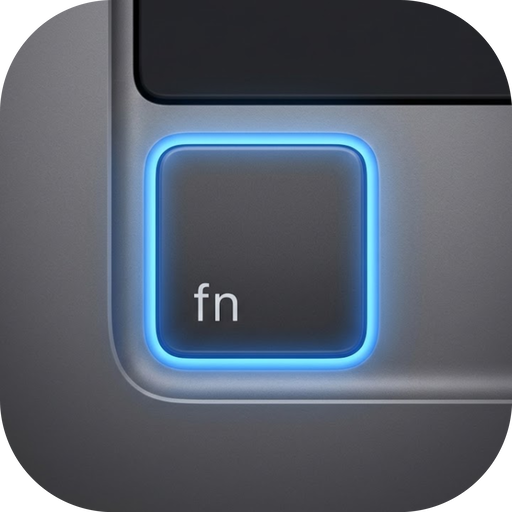

# FnLightSwitch

<p align="center">
  
</p>

A menu-bar utility for macOS that does two things really well:

1. **Switches keyboard layouts** with a quick tap of the Fn key (inherited from FnSwitch).
2. **Boosts display brightness past the SDR cap** on EDR-capable Apple displays — Vivid-style XDR boost, intercepts F1/F2 to step it.

Both features are toggleable from the tray Settings submenu, so you can run only the half you want.

Built with Swift and AppKit. macOS 14+ (Sonoma).

## Features

### Language switching

- **Fn tap detection** — distinguishes quick taps from Fn-as-modifier (Fn+F1, etc.)
- **Reliable switching** — uses TIS APIs directly
- **Consistent OSD** — layout name centered on screen, every time
- **Current layout in tray** — small two-letter indicator (`EN`, `UK`, …)
- **Configurable threshold** — 300 ms tap window (hardcoded)
- Disable from **Settings → Language Switch (Fn key)** if you only want the brightness feature

### XDR Boost

- **HDR-mode pin** — tiny invisible window plays a bundled HDR video to commit the display into HDR mode. Once committed, the player pauses and CPU drops to near zero.
- **Gamma-table multiply** — `CGSetDisplayTransferByTable` with the per-channel gamma values multiplied by the slider's level. Pure public CoreGraphics.
- **F1/F2 takeover** — Vivid-style: when system brightness is at max and XDR boost is enabled, brightness keys step the boost ±0.1 instead of doing nothing. Below max, the keys behave normally.
- **Sun OSD** — custom HUD with sun icon and progress bar appears when stepping with F1/F2.
- **Persists across Space switches** — overlay window is `.canJoinAllSpaces + .stationary`, so HDR mode never blinks during transitions (the original frustration that started this project).
- **Safe restore** — gamma reverts to system default on disable, app exit, or unexpected termination.

### macOS Shortcuts integration

Six AppIntent actions visible in Shortcuts.app:

- Toggle XDR Boost
- Enable XDR Boost
- Disable XDR Boost
- Set XDR Boost Level (slider parameter, 1.0–2.0)
- Increase XDR Boost
- Decrease XDR Boost

Wire these into Shortcuts of your own (hotkey via Shortcuts, Stream Deck, automation chains).

## Install

Download the latest `.dmg` from [Releases](../../releases).

> **Note:** The app is ad-hoc signed. macOS may show a warning. If it refuses to launch:
> ```bash
> xattr -cr /Applications/FnLightSwitch.app
> ```

### Prerequisites

1. Set Fn key to "Do Nothing" in **System Settings → Keyboard → "Press globe key to"**
2. Grant **Accessibility** permission: System Settings → Privacy & Security → Accessibility — add FnLightSwitch (or Terminal if running from source). Used by Fn-tap detection and brightness-key interception.
3. (Optional, only if you want the bundled HDR video to be your own) — see *Bundled HDR video* below.

## Development

### Build

```bash
swift build
.build/debug/FnLightSwitch
```

When running from source via `swift build`, you'll need to grant Accessibility to the terminal you launch it from. For the full XDR-boost flow, build the .app bundle (signed with hardened runtime + entitlements) and run that.

### Package

```bash
scripts/package-app.sh    # → build/FnLightSwitch.app
scripts/package-dmg.sh    # → FnLightSwitch-macOS.dmg
```

After packaging, sign with the bundled entitlements file:

```bash
codesign --force --sign - \
  --entitlements scripts/FnLightSwitch.entitlements \
  --options runtime \
  build/FnLightSwitch.app
```

### Icon

```bash
scripts/make-icon.sh <image.png> [crop-size]
```

### Release

```bash
scripts/release.sh patch   # bumps version, tags
git push && git push --tags
```

### Lint

```bash
swiftlint lint --strict
```

## Architecture

```
Sources/FnLightSwitch/
├── main.swift                # Entry point, AppDelegate, wires everything
├── Settings.swift            # UserDefaults-backed feature toggles
├── FnTapDetector.swift       # CGEventTap — Fn tap vs modifier detection
├── LayoutManager.swift       # TIS APIs — enumerate and switch input sources
├── OSDWindow.swift           # Layout-name overlay
├── StatusBarController.swift # Tray menu (layout, XDR toggle/slider, settings)
├── XDRBoostController.swift  # Orchestrates HDR pin + gamma-table multiply
├── XDRPinWindow.swift        # AVPlayer-backed HDR-mode commit window
├── XDROSDWindow.swift        # Sun-icon HUD shown on F1/F2 boost step
├── XDRKeyTap.swift           # Brightness-key interception
├── XDRBoostIntents.swift     # AppIntent actions for Shortcuts.app
├── DisplayServices.swift     # Private-framework GetBrightness bridge (gate)
└── Resources/
    └── hdr.mov               # Bundled HDR video (see below)
```

## How XDR Boost works

Two cooperating pieces:

1. **HDR pin** — a tiny (8×8) transparent `NSPanel` hosts an `AVPlayerLayer` playing a bundled HDR-tagged `.mov`. macOS only commits the display into HDR mode when an HDR-tagged sample is actively *played* (a static frame in `AVSampleBufferDisplayLayer` isn't enough). Once HDR mode is committed (~2 seconds in), the player pauses; the layer holds the last frame and decode/playback CPU drops to near zero. `.canJoinAllSpaces + .stationary` keeps HDR mode continuously active across Space transitions.

2. **Gamma-table multiply** — once HDR mode is up, the controller reads each display's per-channel gamma table via `CGGetDisplayTransferByTable` (256 floats × 3 channels), multiplies every entry by the slider's level, and writes back via `CGSetDisplayTransferByTable`. On EDR-capable displays in HDR mode, gamma values > 1.0 push the panel past the SDR brightness cap. The Formula version of the same call rejects values > 1.0 with `kCGErrorRangeCheck`; the Table version doesn't validate, so on EDR displays > 1.0 entries pass through. Baseline gamma is cached on first boost so repeated slider movements always multiply the original baseline (otherwise the boost compounds and runs away).

   On disable / app exit / crash, `CGDisplayRestoreColorSyncSettings()` reverts gamma to system default.

The mechanism is decoded from Vivid via `radare2`. The `DisplayServicesSetBrightness*` functions all clamp at 1.0 even with HDR mode active — the gamma-table path is what actually pushes brightness.

### Bundled HDR video

`Sources/FnLightSwitch/Resources/hdr.mov` is currently sourced from Vivid (paid, third-party). For personal/internal use that's fine; for redistribution you'd want to replace it with a self-generated equivalent. The recipe (decoded via static analysis):

- H.264 codec (NOT HEVC)
- 1280×720
- 8-bit 4:2:0 video range
- BT.2020 color primaries + ARIB STD-B67 (HLG) transfer + BT.2020 YCbCr matrix
- Stereo silent AAC audio track alongside

`AVAssetWriter` produces a file with matching surface metadata but the encoded H.264 bitstream's VUI/SEI parameters apparently don't trigger DisplayServices the same way — `ffmpeg` with `libx264` would have full control over those if you want to pursue self-generation.

## License

MIT
